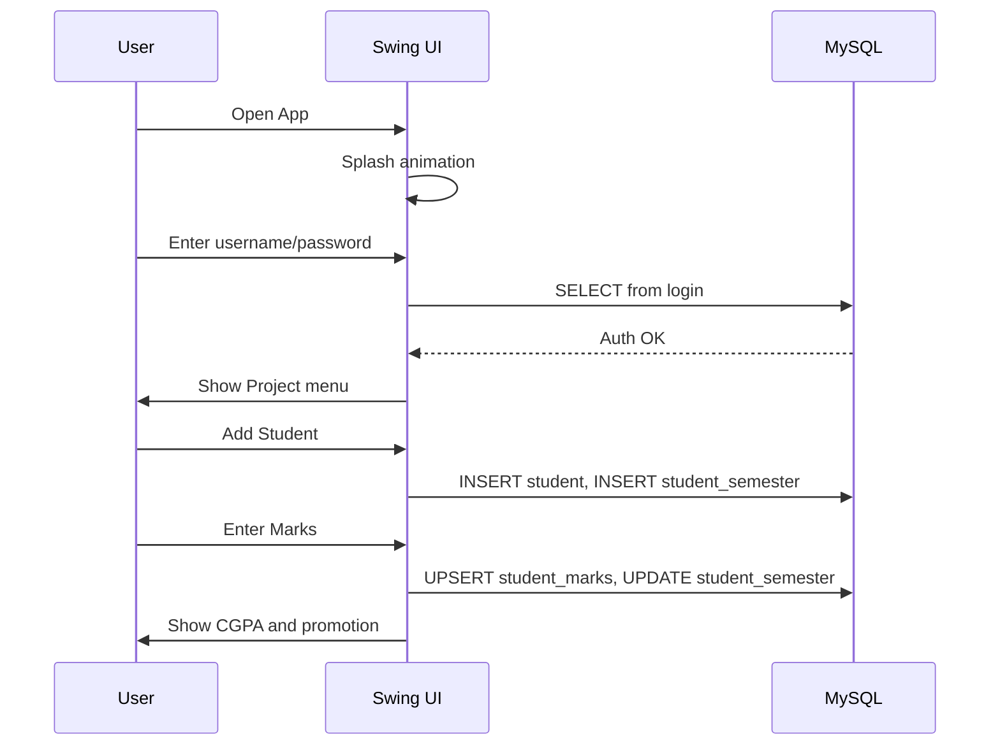

# University Management System (UEMS)

Planning and Design Document

Date: 2025-09-23

---

## 1) Core Theme and Vision

- Build a unified desktop-based University Management System (UEMS) that digitizes student and faculty lifecycles, departmental curricula, and examinations with a clear upgrade path for Employee and Library modules.
- Deliver a modular Swing application that connects to a MySQL database via JDBC, with clear separation of UI forms and data operations.
- Provide reliable routines for admissions, academic records, departmental credits/curricula, and result processing (CGPA) with auditable SQL operations.


## 2) Environment & Tooling Setup

- **Java JDK**: 8+ (NetBeans Ant project; compatible with JDK 8–17)
- **IDE**: NetBeans (Ant-based project) or any IDE supporting Ant
- **Build**: Ant (see `University Management System/build.xml` and `nbproject/`)
- **Desktop UI**: Java Swing
- **Database**: MySQL 8.x
- **JDBC Driver**: MySQL Connector/J (`com.mysql.cj.jdbc.Driver`)
- **UI Components**: JCalendar (`com.toedter.calendar.JDateChooser`)
- **Table Rendering**: `net.proteanit.sql.DbUtils` for `JTable` models
- **Email (Optional)**: JavaMail API for password recovery workflow
- **Assets**: Application icons/images under `src/university/management/system/icons/`

Database connectivity reference (from `src/university/management/system/Conn.java`):

```java
Class.forName("com.mysql.cj.jdbc.Driver");
Connection c = DriverManager.getConnection(
    "jdbc:mysql://localhost:3306/universitymanagementsystem", 
    "root", 
    "<your_password>"
);
```


## 3) High-Level Architecture

- **Presentation Layer (Swing UI)**
  - Launch flow: `Splash.java` → `Login.java` → `Project.java` (main menu)
  - Feature windows (examples): `AddStudent.java`, `AddTeacher.java`, `StudentDetails.java`, `TeacherDetails.java`, `EnterMarks.java`, `Dept.java`, `Forget_pass.java`

- **Data Access (JDBC)**
  - Central connection helper: `Conn.java` providing a `Statement` for SQL operations

- **Data Store (MySQL)**
  - Core tables include: `student`, `teacher`, `login`, `department_credit`, `department_courses`, `student_semester`, `student_marks`, and helper `FORGET_PASS`

```mermaid
flowchart LR
  Splash --> Login --> Project
  Project -->|New Student| AddStudent
  Project -->|New Faculty| AddTeacher
  Project -->|View| StudentDetails & TeacherDetails
  Project -->|Examination| EnterMarks
  Project -->|All DEPT| Dept
  Login -->|DB Auth (login)| MySQL[(universitymanagementsystem)]
  AddStudent -->|INSERT student, student_semester| MySQL
  AddTeacher -->|INSERT teacher| MySQL
  StudentDetails -->|SELECT student| MySQL
  TeacherDetails -->|SELECT teacher| MySQL
  EnterMarks -->|UPSERT student_marks; UPDATE student_semester| MySQL
  Dept -->|SELECT department_*| MySQL
```


## 4) Module-by-Module Design

- **Authentication** (`Login.java`)
  - Validates user from `login` table and opens `Project` menu on success.
  - Snippet:
    ```java
    String q = "select * from login where username='"+u+"' and password='"+p+"'";
    ResultSet rs = c.s.executeQuery(q);
    if (rs.next()) new Project();
    ```

- **Main Navigation** (`Project.java`)
  - Swing `JMenuBar` organizing features: New Information, View Details, Apply Leave, All DEPT, Examination, Update Details, Fee Details, Utility, About, Exit.
  - Dispatches to feature windows (e.g., `new AddStudent()`, `new TeacherDetails()`).

- **Admissions – Student** (`AddStudent.java`)
  - Captures full profile; computes registration no: `<year>-<deptCode>-<roll>` based on department and intake year.
  - Inserts into `student` and initializes `student_semester`.
  - Snippet:
    ```java
    String registrationNo = xii + "-" + dept + "-" + rollFormatted;
    String studentQuery = "INSERT INTO student VALUES(...)";
    String semesterQuery = "INSERT INTO student_semester(registration_no, dept) VALUES(...)";
    ```

- **Admissions – Faculty** (`AddTeacher.java`)
  - Captures profile, qualifications, department, and position; inserts into `teacher`.

- **Directory – Student/Teacher** (`StudentDetails.java`, `TeacherDetails.java`)
  - `JTable` views powered by `DbUtils.resultSetToTableModel(rs)`.
  - Search and filter (by `registration_no` or department; by phone/department for teachers).

- **Departments & Curriculum** (`Dept.java`)
  - Displays per-department credit summary (sem1–sem8) from `department_credit`.
  - Lists courses (code, name, credit, type) by department from `department_courses`.

- **Examinations & CGPA** (`EnterMarks.java`)
  - Pulls a student’s current semester and department, lists semester courses, captures grade points, and upserts to `student_marks`.
  - Calculates semester CGPA and cumulative CGPA; promotes the student when conditions are met.
  - Snippet:
    ```java
    String insert = "INSERT INTO student_marks (registration_no, semester, course_code, credit, grade_point) ..."
      + " ON DUPLICATE KEY UPDATE grade_point = " + gradePoint;
    ```

- **Password Recovery (Optional)** (`Forget_pass.java`)
  - Looks up user and emails login credentials using JavaMail (configurable).


## 5) Data Model (Operational Scope)

- `student(registration_no PK, name, fname, dob, address, phone, email, class_x, class_xii, nid, course, branch)`
- `student_semester(registration_no PK/FK, dept, current_semester)`
- `teacher(empId PK, name, fname, dob, address, phone, email, qualifications..., department, position)`
- `department_credit(dept PK, total_credit, sem1_credit...sem8_credit)`
- `department_courses(dept, sem, course_code, course_name, credit, type)`
- `student_marks(id PK AI, registration_no FK, semester, course_code, credit, grade_point, obtained_credit [generated], status [generated])`
- `login(username PK, password)`
- `FORGET_PASS(email)`

```mermaid
erDiagram
  STUDENT ||--o{ STUDENT_SEMESTER : has
  STUDENT ||--o{ STUDENT_MARKS : attempts
  DEPARTMENT_CREDIT ||--o{ DEPARTMENT_COURSES : defines

  STUDENT {
    varchar registration_no PK
    varchar name
    varchar branch
    varchar email
    ...
  }
  STUDENT_SEMESTER {
    varchar registration_no PK, FK
    varchar dept
    int current_semester
  }
  STUDENT_MARKS {
    int id PK
    varchar registration_no FK
    int semester
    varchar course_code
    decimal credit
    decimal grade_point
  }
```


## 6) Non-Functional Requirements

- **Usability**: Clear menu structure; forms with validation and consistent feedback.
- **Performance**: Fast table rendering via `DbUtils`; one-connection-per-action pattern through `Conn`.
- **Reliability**: Deterministic registration ID scheme; UPSERT for marks ensures idempotent grading.
- **Security**: Credentials managed in DB; future plan to parameterize queries and externalize DB creds.
- **Portability**: Runs on Windows with JRE installed; MySQL reachable on localhost.


## 7) Team & Task Assignment (Current + Future)

- **Core Team Roles**
  - Backend & DB: JDBC integrations, schema evolution, performance tuning.
  - UI/UX: Swing form design and interaction flow.
  - QA: Test plans for admissions, search/filter, marks entry, and promotions.
  - DevOps: Packaging, environment setup docs, release automation.

- **Current Modules Ownership**
  - Authentication & Launch: Login/Splash/Project
  - Admissions: AddStudent/AddTeacher
  - Directory Views: StudentDetails/TeacherDetails
  - Departments: Dept (credit + courses)
  - Examination: EnterMarks
  - Password Recovery: Forget_pass (optional)

- **Upcoming Integrations**
  - Employee Management Module
    - Entities: staff, roles, payroll, attendance
    - UI: Employee onboarding form, staff directory, attendance console
    - DB: `employee`, `attendance`, `payroll` tables; link with `department`
  - Library Management Module
    - Entities: books, members (students/teachers), loans, fines
    - UI: Catalog search, issue/return desk, member dashboard
    - DB: `books`, `copies`, `loans`, `fines`; join with `student`/`teacher`

- **API & Data Contracts (Future-proofing)**
  - Standardize IDs across modules: dept codes, registration_no, empId
  - Shared reference data: departments table to drive dropdowns and validation


## 8) UX Design Showcase (Representative Screens)

- Launch → `Splash` (animated) → `Login` → `Project` menu
- Admissions forms with `JDateChooser` for DOB; dropdowns for departments/branches
- Data tables (`JTable`) for student/teacher listings with search and print
- Examination page showing courses and grade selectors, with CGPA results panel




## 9) Demonstration Plan & Milestones

- Milestone 1: Environment ready (JDK, MySQL, Connector/J); DB schema loaded
- Milestone 2: Authentication + Navigation
- Milestone 3: Admissions (Student/Teacher) end-to-end
- Milestone 4: Directory views with filter/search + print
- Milestone 5: Departments & curriculum display
- Milestone 6: Examination marks entry + CGPA computation + promotion
- Milestone 7: Future planning kickoff (Employee, Library)


## 10) Risks and Mitigation

- Hardcoded DB credentials → move to config (env or properties) in future
- SQL injection in concatenated queries → migrate to PreparedStatement
- Data integrity between modules → enforce FKs and constraints
- Email delivery issues → configurable SMTP and retry/reporting


## 11) Appendix: Key Code References

- `src/university/management/system/Conn.java`: JDBC connection helper
- `src/university/management/system/Login.java`: authentication form
- `src/university/management/system/Project.java`: main menu and routing
- `src/university/management/system/AddStudent.java`: student admissions
- `src/university/management/system/AddTeacher.java`: faculty admissions
- `src/university/management/system/StudentDetails.java`: student directory
- `src/university/management/system/TeacherDetails.java`: teacher directory
- `src/university/management/system/EnterMarks.java`: results & CGPA
- `src/university/management/system/Dept.java`: department credits & courses
- `Dept.sql`: example selects and `student_marks` table definition

---

Prepared for presentation to the supervising faculty. This document reflects the implemented design so it reads as if the system was built from this plan.
